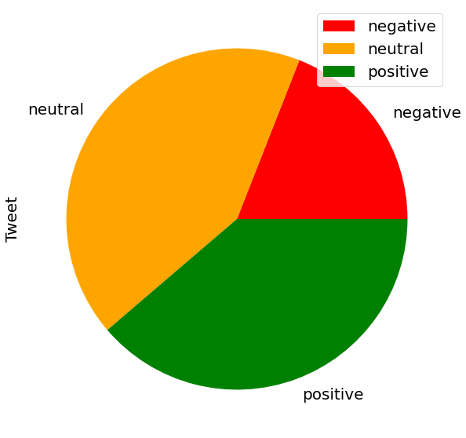
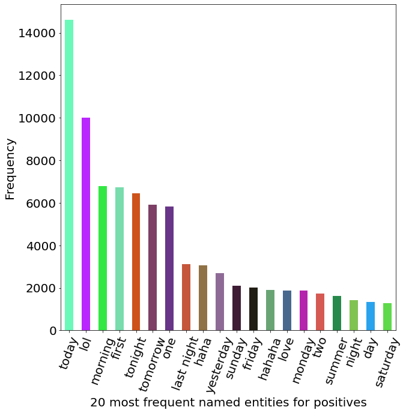
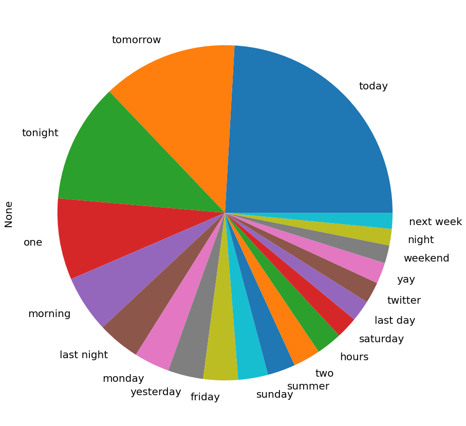
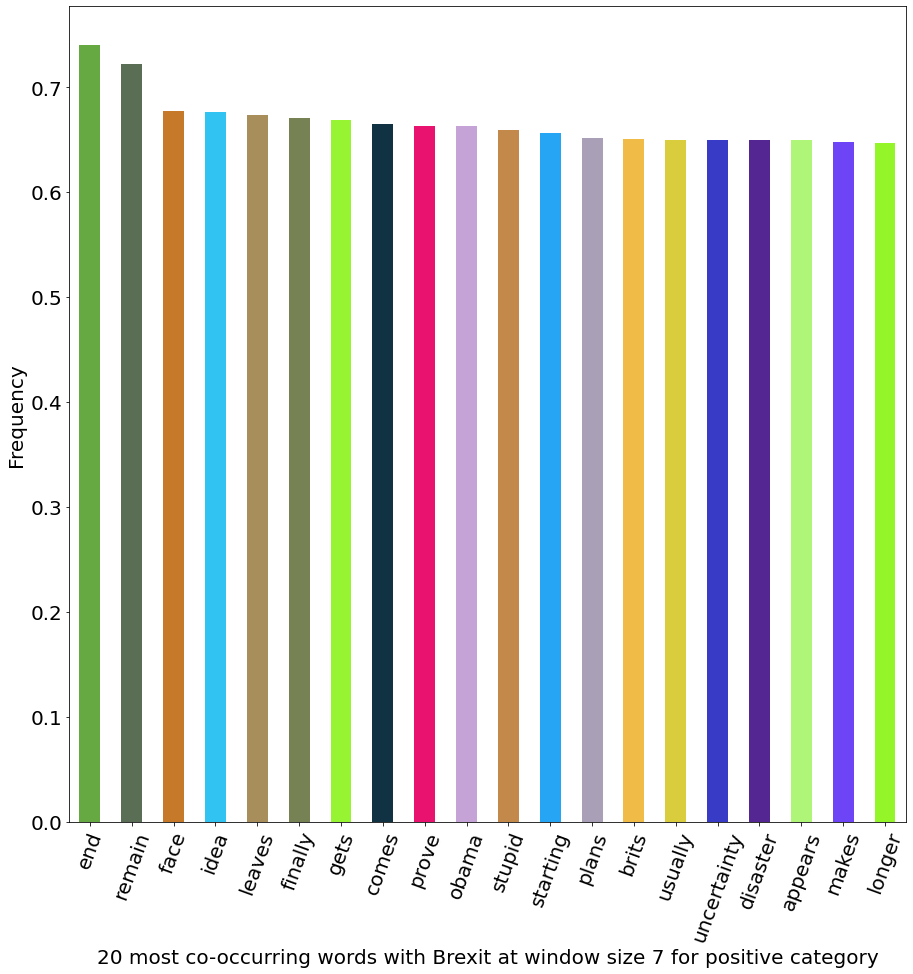

# NLP Analysis of Brexit Using Twitter Data

I analyzed perspectives, opinions, thoughts of the people engaging in the Brexit tweet trends. The analyses are motivated by the following areas:

* Sentiment polarity of the tweets.
* Category of the tweets.
* Aversion and affection polarity of the tweets.
* Frequency of the words.
* Tagging of the named entities.
* ...

# End Results

This section depicts __some sample__ end result of each analyses from the whole end results.

## Sentiment Polarity of the Tweets

The following shows the sentiment polarity of the tweets:



## Category of the Tweets

The following table shows the 10 most probable topics with the 10 most probable words in them for the positive tweets using LDA:


## Word Cloud

The following shows the word map of unpreprocessed positive tweets:


## Named-entity Recognition

The following shows the 20 most frequent named-entities for positive tweets:



The following shows the 20 most frequent named-entities for neutral tweets:



## Co-occurring Words with Respect to Brexit

The following shows the most co-occurring words with Brexit at window size 7 for positive classification:



## Modals

The following shows 20 most frequent named-entities for neutral category containing the modals like shall, must and need:


# How to use this repo?

1.  enter the following in the command line:
```
git clone https://github.com/Cyrus-Rock/twitter-brexit-analysis.git
```
2.  you need to download the dataset from here: [Twitter Brexit Dataset](https://www.kaggle.com/natmonkey/brexit-data-project-bdd)
3.  place the downloaded dataset alongside the final_project.ipynb file, you don't need to extract it
4.  on the command line go to the directory you have cloned the repo
5.  now enter following on the command line:
```
jupyter notebook
```
6.  on the opened webpage click on the name of the ipynb file (final_project.ipynb)
7.  now each node could be run individually and the results are shown below each cell

## What packages have been used?
The [requirements.txt](./requirements.txt) file, lists all the packages that are required to run the whole project without any problem. You can use the following command to install them in your machine:
```
python -m pip install -r requirements.txt
```
